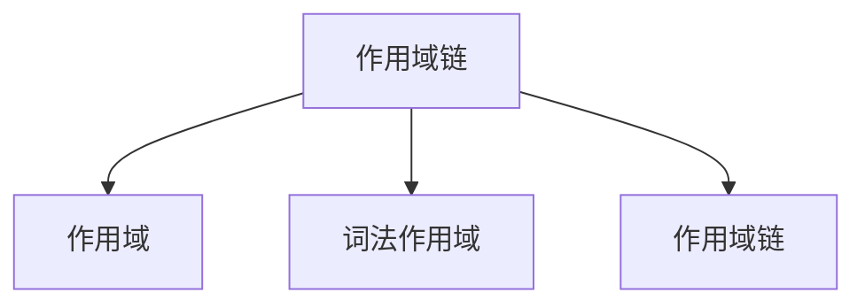

# JavaScript

## 1. JS 数据类型有哪些？

#### 类型：`基础`

#### 级别：`W1`

#### 解答（2 分）

- **1：** 基本类型：字符串（String）、数字(Number)、布尔(Boolean)、空（Null）、未定义（Undefined）、Symbol（ES6特性）、BigInt（ES11特性）；
- **1：** 引用类型：对象（Object）、函数（Function）、数组（Array）等；

## 2. == 和 === 的区别是什么？

#### 类型：`基础`

#### 级别：`W1`

#### 解答（2 分）

- **1：** == 是 宽松相等，会进行类型转换，比较前会先转换两边的操作数类型（例如，'5' == 5 为 true;
- **1：** === 是 严格相等，不会进行类型转换，只有两边的值和类型都相同才会返回 true（例如，'5' === 5 为 false;

## 3. var 、let 、 const 的区别是什么？

#### 类型：`基础`

#### 级别：`W1`

#### 解答（2 分）

- **1：** var 作用域: 函数作用域（如果在函数内部声明），全局作用域（如果在函数外部声明）;
              提升: 声明和初始化都会被提升（变量提升，但未初始化时是 undefined）;
- **1：** let、 const 作用域: 级作用域（只在其所在的代码块内有效）;
          提升: 变量提升但不会初始化，存在“暂时性死区”，即在声明之前不能访问;
- **1：** 区别:
            const： 需要在声明时初始化，且之后不能被修改;
            let：可以修改其值;
            var： 是函数作用域或全局作用域，let 和 const 是块级作用域;

## 4. 什么是事件冒泡和事件捕获？

#### 类型：`基础`

#### 级别：`W1`

#### 解答（2 分）

- **1：** 事件冒泡：事件从目标元素开始，向上冒泡到 document;
- **1：** 事件捕获：事件从 document 开始，向下捕获到目标元素;
- **1：** 事件流顺序: 1.捕获 -> 2.目标 -> 3.冒泡;
- **2：** 引用类型：对象（Object）、函数（Function）、数组（Array）等；

## 5. JS 什么是防抖和节流？它们的应用场景有哪些？

#### 类型：`基础`

#### 级别：`W1`

#### 解答（3 分）

- **1：** 防抖：在事件被触发后，延迟一定时间后再执行回调函数，如果在延迟时间内再次触发事件，则重新计算延迟时间，直到延迟时间结束后才执行回调函数。例如，在用户输入搜索框时，防止频繁发送请求，可以使用防抖函数，只有在用户停止输入一段时间后才发送搜索请求。
- **2：** 节流：在一定时间内，只允许函数执行一次。例如，在页面滚动时，需要频繁执行某个函数来处理滚动事件，但为了避免函数执行过于频繁影响性能，可以使用节流函数，限制函数在一定时间内只执行一次。

## 6. JS 请解释在 JavaScript 中this指针的工作原理，在以下函数调用场景中this指向什么？

#### 类型：`基础`

#### 级别：`W1`

```js
const person = {
    name: "张三",
    sayHello: function() {
        console.log(`你好，我的名字叫 ${this.name}`);
    }
};
person.sayHello();
```

#### 解答（2 分）

- **1：** 在person.sayHello()调用中，this指向person对象。
- **1：** 当一个函数作为对象的方法被调用时，this指向调用该方法的对象。在这里，sayHello是person对象的方法，所以this指代person，因此可以正确访问person.name

## 7. JS 请解释setTimeout和setInterval的区别，并说明如何清除定时器

#### 类型：`基础`

#### 级别：`W1`、`W2`、`W3`、`W4`、`W5`、`W6`

#### 解答（2 分）

- **1：** setTimeout：在指定的延迟时间（毫秒）后执行一次回调函数。示例：setTimeout(() => console.log('Delayed'), 1000);，1 秒后会执行一次回调打印Delayed。
setInterval：按照指定的时间间隔（毫秒）重复执行回调函数。示例：let intervalId = setInterval(() => console.log('Repeating'), 1000);，每隔 1 秒就会执行一次回调打印Repeating。
- **1：** 使用clearTimeout清除setTimeout创建的定时器，传入setTimeout返回的定时器 ID。例如：const timeoutId = setTimeout(() => console.log('Timeout'), 2000); clearTimeout(timeoutId);，这样就会取消即将执行的setTimeout回调。
          使用clearInterval清除setInterval创建的定时器，传入setInterval返回的定时器 ID，如clearInterval(intervalId);会停止setInterval的重复执行。

## 8. Promise 的常用方法

#### 类型：`基础`

#### 级别：`W1`、`W2`、`W3`、`W4`、`W5`、`W6`

#### 解答（7 分）

- **1：** Promise.resolve(value)：返回一个已解决的 Promise，如果 value 是一个 Promise，返回的 Promise 会继承其状态。
- **1：** Promise.reject(reason)：返回一个已拒绝的 Promise，带有拒绝的原因。
- **1：** Promise.all(iterable)：接收一个可迭代对象，返回一个新的 Promise，当所有 Promise 都成功时返回结果数组，若有任何 Promise 失败，返回的 Promise 会立即失败。
- **1：** Promise.race(iterable)：返回一个 Promise，它会在第一个完成的 Promise 状态改变时返回该 Promise 的结果（无论是成功还是失败）。
- **1：** Promise.allSettled(iterable)：返回一个新的 Promise，在所有输入的 Promise 完成时返回，结果包含每个 Promise 的状态及其结果。
- **1：** Promise.any(iterable)：返回一个新的 Promise，它会在第一个成功的 Promise 完成时返回成功结果，如果所有的 Promise 都失败，则返回一个拒绝的 Promise。
- **1：** Promise.finally(onFinally)：无论 Promise 成功或失败，都会执行 onFinally 回调，常用于清理操作。

## 9. 解释 Set 和 Map 的使用及区别

#### 类型：基础

#### 级别：W5

#### 解答（2 分）

- **1：** Set：是一个集合，用于存储不重复的值，按照插入顺序排列。
- **1：** Map：是一个键值对集合，用于存储键值对，可以存储任何类型的键和值。

```js
// Set
let set = new Set();
set.add(1);
set.add(2);
set.add(2); // 会被忽略
console.log(set); // Set { 1, 2 }

// Map
let map = new Map();
map.set('name', 'Alice');
map.set('age', 25);
console.log(map.get('name')); // Alice

```

## 10. 请写出几个 JavaScript 函数，用于实现数组去重

#### 类型：`基础`

#### 级别：`W1`、`W2`、`W3`、`W4`、`W5`、`W6`

#### 解答（8 分）

<details>

- **1：** 方法一：使用Set对象（ES6 及以上）

```js
//原理：Set是一种新的数据结构，它类似于数组，但是成员的值都是唯一的。可以将数组转换为Set，然后再转换回数组来实现去重。
function uniqueArray(arr) {
    return [...new Set(arr)];
}
let array = [1, 2, 2, 3, 4, 4];
console.log(uniqueArray(array)); // 输出[1, 2, 3, 4]
//解释：new Set(array)会创建一个Set对象，其中包含了array中的所有元素，并且自动去重。然后，通过扩展运算符...将Set对象转换回数组，得到去重后的结果。
```

- **1：** 方法二：使用循环和一个新数组

```js
function uniqueArray(arr) {
    let newArray = [];
    for (let i = 0; i < arr.length; i++) {
        if (!newArray.includes(arr[i])) {
            newArray.push(arr[i]);
        }
    }
    return newArray;
}
let array = [1, 2, 2, 3, 4, 4];
    console.log(uniqueArray(array)); // 输出[1, 2, 3, 4]
```

- **2：** 方法三：使用filter方法和indexOf函数

```js
//原理：filter方法用于过滤数组中的元素，indexOf函数用于查找元素在数组中的首次出现位置。通过filter方法遍历数组，只保留首次出现的元素，从而实现去重。
let array = [1, 2, 2, 3, 4, 4];
let uniqueArray = array.filter((element, index, self) => {
    return self.indexOf(element) === index;
});
console.log(uniqueArray);
//解释：filter方法的回调函数接收三个参数：element（当前元素）、index（当前元素的索引）和self（数组本身）。在回调函数中，self.indexOf(element)会查找element在数组中的首次出现位置。如果这个位置等于当前元素的索引index，说明这个元素是首次出现的，filter方法会保留这个元素；否则，就过滤掉这个元素。最终filter方法返回一个新的去重后的数组。
```

- **2：** 方法四：使用reduce方法

```js
//原理：reduce方法用于对数组中的每个元素执行一个由您提供的reducer函数（升序执行），将其结果汇总为单个返回值。可以利用reduce方法来构建一个新的去重数组。
let array = [1, 2, 2, 3, 4, 4];
let uniqueArray = array.reduce((acc, cur) => {
    if (!acc.includes(cur)) {
        acc.push(cur);
    }
    return acc;
}, []);
console.log(uniqueArray);
//解释：reduce方法的第一个参数是一个reducer函数，它接收两个参数：acc（累加器，初始值是一个空数组[]）和cur（当前元素）。在reducer函数中，如果acc数组不包含cur元素（acc.includes(cur)返回false），就将cur添加到acc中。最后，reduce方法返回acc，即去重后的数组。
```

- **2：** 方法五：使用Object对象（以元素为键）

```js
//原理：利用Object的键的唯一性，将数组元素作为对象的键，值可以任意设置（这里设置为true），然后获取对象的键并转换回数组来实现去重。
let array = [1, 2, 2, 3, 4, 4];
let uniqueArray = [];
let tempObj = {};
for (let i = 0; i < array.length; i++) {
    let current = array[i];
    if (!tempObj[current]) {
        uniqueArray.push(current);
        tempObj[current] = true;
    }
}
console.log(uniqueArray);
//解释：首先创建一个空数组uniqueArray用于存储去重后的元素，以及一个空对象tempObj。然后遍历array数组，对于每个元素current，检查tempObj对象中是否已经存在以current为键的属性（tempObj[current]是否为true）。如果不存在，就将current添加到uniqueArray中，并在tempObj中添加一个以current为键，值为true的属性。这样，利用对象键的唯一性实现了数组去重。最后返回uniqueArray。
```

</details>

## 11. ES6 和 CommonJS 的区别

#### 类型：基础

#### 级别：`W1`、`W2`、`W3`、`W4`、`W5`、`W6`

#### 解答（4 分）

- **2：** CommonJS是对模块的浅拷⻉，ES6 Module是对模块的引⽤，即ES6 Module只存只读，不能改变其值，也就是指针指向不能变，类似const
- **2：** import的接⼝是read-only（只读状态），不能修改其变量值。 即不能修改其变量的指针指向，但可以改变变量内部指针指向，可以对commonJS对重新赋值（改变指针指向），但是对ES6 Module赋值会编译报错

注：S6 Module和CommonJS模块的共同点：

CommonJS和ES6 Module都可以对引⼊的对象进⾏赋值，即对对象内部属性的值进⾏改变

[docs](https://juejin.cn/post/7331931937357496354)

## 12. new 操作符的实现原理

#### 类型：基础

#### 级别：`W1`、`W2`、`W3`、`W4`、`W5`、`W6`

#### 解答（2 分）

<details>

- **2：** new操作符的执行过程：

>（1）首先创建了一个新的空对象
>
>（2）设置原型，将对象的原型设置为函数的 prototype 对象
>
>（3）让函数的 this 指向这个对象，执行构造函数的代码（为这个新对象添加属性）
>
>（4）判断函数的返回值类型，如果是值类型，返回创建的对象。如果是引用类型，就返回这个引用类型的对象

```js
function objectFactory() {
  let newObject = null;
  let constructor = Array.prototype.shift.call(arguments);
  let result = null;
  // 判断参数是否是一个函数
  if (typeof constructor !== "function") {
    console.error("type error");
    return;
  }
  // 新建一个空对象，对象的原型为构造函数的 prototype 对象
  newObject = Object.create(constructor.prototype);
  // 将 this 指向新建对象，并执行函数
  result = constructor.apply(newObject, arguments);
  // 判断返回对象
  let flag = result && (typeof result === "object" || typeof result === "function");
  // 判断返回结果
  return flag ? result : newObject;
}
// 使用方法
objectFactory(构造函数, 初始化参数);
```

</details>

## 13. 数组的原生方法有哪些？

#### 类型：基础

#### 级别：`W1`、`W2`、`W3`、`W4`、`W5`、`W6`

#### 解答（7 分）

<details>

- **1：** 数组和字符串的转换方法：toString()、toLocalString()、join() 其中 join() 方法可以指定转换为字符串时的分隔符。
- **1：** 数组尾部操作的方法 pop() 和 push()，push 方法可以传入多个参数。
- **1：** 数组首部操作的方法 shift() 和 unshift() 重排序的方法 reverse() 和 sort()，sort() 方法可以传入一个函数来进行比较，传入前后两个值，如果返回值为正数，则交换两个参数的位置。
- **1：** 数组连接的方法 concat() ，返回的是拼接好的数组，不影响原数组。
- **1：** 数组截取办法 slice()，用于截取数组中的一部分返回，不影响原数组。
- **1：** 数组插入方法 splice()，影响原数组查找特定项的索引的方法，indexOf() 和 lastIndexOf() 迭代方法 every()、some()、filter()、map() 和 forEach() 方法
- **1：** 数组归并方法 reduce() 和 reduceRight() 方法

</details>

## 14. bind、call、apply 区别

#### 类型：基础

#### 级别：`W1`、`W2`、`W3`、`W4`、`W5`、`W6`

#### 解答（3 分）

<details>

- **1：** call 和apply 都是为了解决改变 this 的指向。作⽤都是相同的，只是传参的⽅式不同
- **1：** 除了第⼀个参数外，call 可以接收⼀个参数列表，apply 只接受⼀个参数数组

```js
let a = { value: 1 }
function
  getValue(name, age) {
  console.log(name)
  console.log(age)
  console.log(this.value)
}
getValue.call(a, 'yck','24')
getValue.apply(a,['yck', '24'])
```

- **1：** bind 和其他两个⽅法作⽤也是⼀致的，只是该⽅法会返回⼀个函数。并且我们可以通过 bind 实现柯⾥化

</details>

## 15. == 和 ===区别，什么情况⽤ ==

#### 类型：基础

#### 级别：`W1`、`W2`、`W3`、`W4`、`W5`、`W6`

#### 解答（1 分）

- **1：** ===⽤于判断两者类型和值是否相同。在开发中，对于后端返回的 code，可以通过 == 去判断

## 16. Proxy 的使用

#### 类型：基础

#### 级别：`W1`、`W2`、`W3`、`W4`、`W5`、`W6`

#### 解答（6 分）

<details>

- **4：** 部分 API


- **1：** 函数调用的监听

```js
function fun() {
    console.log("哈哈哈");
}

const objProxy = new Proxy(fun, {
    /**
     * 拦截对函数的调用的捕获器
     * @param target target new Proxy 所代理的 obj（监听的对象）
     * @param thisArg 调用函数时绑定的 this 值
     * @param argArray 调用函数时传递的参数列表
     */
    apply(target, thisArg, argArray) {
        console.log("对 fun 函数进行了 apply 的调用。");
        // 调用原始函数，并在其结果前后添加一些内容
        target.apply(thisArg, argArray)
    },
    /**
     * 监听 class 时的捕获器
     * @param target target new Proxy 所代理的 obj（监听的对象）
     * @param argArray new fun() 时传入的参数，例：new fun(1, 2, ...rest)
     * @param newTarget 被调用的构造函数。在这里，newTarget 就是 objProxy 本身，因为 objProxy 是一个函数代理
     */
    construct(target, argArray, newTarget) {
        console.log("对 fun 函数进行了 construct 的调用。");
        return new target(...argArray)
    }
});

objProxy.apply();
new objProxy();

```

- **1：** new Proxy 中 receiver 参数的作用

```js
const obj = {
    _name: "里斯",
    age: 16,
    get name() {
        return this._name;
    },
    set name(newValue) {
        this._name = newValue;
    }
};

const objProxy = new Proxy(obj, {
    /**
     * receiver 就是 objProxy 这个代理对象
     * receiver 传入 Reflect.get 之后，他就作为 obj 里的 this 了（this 这个时候就改变了）
     *
     */
    get(target, key, receiver) {
        console.log(receiver);
        /**
         * 传入 receiver 后，他被访问了两次
         */
        return Reflect.get(target, key, receiver);
    },
    set(target, key, newValue, receiver) {
        Reflect.set(target, key, newValue, receiver);
    }
});

objProxy.name = "哈哈哈";
console.log(objProxy.name);
```

</details>

## 17. Object.defineProperty 的使用

#### 类型：基础

#### 级别：`W1`、`W2`、`W3`、`W4`、`W5`、`W6`

#### 解答（4 分）

<details>

- **1：** Object.defineProperty 的设计初中不是为了监听对象中属性变化的，而是为了定义访问属性描述符。

- **1：** 访问属性描述符包括：configurable、enumerable、writable、value

- **1：** 访问属性描述符的方法：Object.getOwnPropertyDescriptor()

- **1：** 缺点

    ① 一次监听太多的时候，不是很友好

    ② 新增、删除的时候，他是无能为力的

    ③ 会修改原对象中的属性

```js
const obj = {
    name: "里斯",
    age: 16
};

/**
 * 监听某个属性
 */
/*
Object.defineProperty(obj, "name", {
    set(v) {
        console.log(v);
        console.log("监听到 set");
    },
    get() {
        console.log("监听到 get");
    }
});
*/

/**
 * 监听所有的属性
 */
Object.keys(obj).forEach(key => {
    console.log(key);
    let value = obj[key];
    Object.defineProperty(obj, key, {
        set(v) {
            console.log(`监听到属性 ${key}，被 set 为 ${v}`);
            value = v;
        },
        get() {
            console.log(`监听到属性 ${key} get`);
            return value;
        }
    });
});


obj.name = "哈哈哈";

console.log(obj.name);
```

</details>

## 18. 作用域链的理解

#### 类型：基础

#### 级别：`W1`、`W2`、`W3`、`W4`、`W5`、`W6`

#### 解答（5 分）

注：作用域链是指在 JavaScript 中，当访问一个变量时，JavaScript 引擎会按照一定的顺序在当前作用域以及其上层作用域中查找该变量。这个查找的过程就形成了作用域链。

<details>

- **1：** 数据类型



- **1：** 作用域

作用域即变量（变量作用域又称上下文）和函数生效（能被访问）的区域或集合。它决定了代码区块中变量和其他资源的可见性。
例如：

```js

function greet() {
  var greeting = 'Hello World!';
  console.log(greeting);
}
greet();

console.log(greeting);// Uncaught ReferenceError: greeting is not defined

```

- **1：** 全局作用域

任何不在函数中或是大括号中声明的变量，都是在全局作用域下。全局作用域下声明的变量可以在程序的任意位置访问。

```js
// 全局变量
var greeting = 'Hello World!';
function greet() {
  console.log(greeting);
}
// 打印 'Hello World!'
greet();
```

- **1：** 函数作用域

```js
function greet() {
  var greeting = 'Hello World!';
  console.log(greeting);
}
// 打印 'Hello World!'
greet();
// 报错: Uncaught ReferenceError: greeting is not defined
console.log(greeting);

```

- **1：** 块级作用域

ES6 引入：ES6 引入了let和const关键字，与var关键字不同，在大括号中使用let和const声明的变量存在于块级作用域中。在大括号之外不能访问这些变量。

```js
{
  // 块级作用域中的变量
  let greeting = 'Hello World!';
  var lang = 'English';
  console.log(greeting); // Prints 'Hello World!'
}
// 变量 'English'
console.log(lang);
// 报错: Uncaught ReferenceError: greeting is not defined
console.log(greeting);
```

- **1：** 词法作用域

词法作用域又叫静态作用域，变量在创建时就确定好了其作用域，而非在执行阶段确定。也就是说，在编写代码时作用域就已经确定了，JavaScript 遵循的就是词法作用域

```js

var a = 2;
function foo() {
  console.log(a);
}
function bar() {
  var a = 3;
  foo();
}
bar();
```

- **1：** 作用域链

在 JavaScript 中使用一个变量时，JavaScript 引擎会尝试在当前作用域下去寻找该变量。如果没找到，再到它的上层作用域寻找，以此类推直到找到该变量或是已经到了全局作用域。

如果在全局作用域里仍然找不到该变量，它就会在全局范围内隐式声明该变量（非严格模式下）或是直接报错。

```js

var sex = '男';
function person() {
    var name = '张三';
    function student() {
        var age = 18;
        console.log(name); // 张三
        console.log(sex); // 男
    }
    student();
    console.log(age); // Uncaught ReferenceError: age is not defined
}
person();

/*
student 函数内部：
当查找name时，在student函数内部找不到，向上一层作用域（person函数内部）找，找到了输出 “张三”。
当查找sex时，在student函数内部找不到，向上一层作用域（person函数内部）找，还找不到继续向上一层找，即全局作用域，找到了输出 “男”。

person 函数内部：
当查找age时，在person函数内部找不到，向上一层找，即全局作用域，还是找不到则报错。

*/
```

</details>

## 19. 柯里化

#### 类型：基础

#### 级别：`W1`、`W2`、`W3`、`W4`、`W5`、`W6`

#### 解答（4 分）

<details>

给函数传递一部分参数来调用这个函数，并且 当前的这个函数他会在返回一个函数，去处理剩余的参数，见下面 示例：


也就是 拆分函数的参数，这样的就可以叫 柯里化。

- **1：** 使用函数柯里化的好处？

在函数式的编程中，尽量 让一个函数处理一个问题，尽可能的单一，而不是将一些问题交给一个方法去解决，就好比 react 的函数式组件，你的一个功能组件是经过多个 UI 组件合成而来的一样，所以我们可以将每次传入的参数在，当前函数中处理，在当前函数处理完成后，在下一个函数中在使用上一个函数的处理结果即可。

- **1：** 例子

实现一个给第一个参数加2，给第二个参数乘2的例子


- **2：** 柯里化函数的实现

```js
/**
 * 多参函数 转 柯里化函数
 */
function currying(fn) { // 接受一个函数,返回一个函数
    // 这里是接受剩余参数
    function receivedParameters(...args) {
        // 判断当前已经接受到的参数的个数, 和参数本身(这个参数本身就是一个函数)需要接收到参数是否已经一致
        // console.log(fn.length);
        // console.log(args.length);
        // 到传入函数的参数(fn 的参数) 大于 传入的参数(...args)时,就直接调用传入的函数
        if (args.length >= fn.length) {
            // 这个 apply 是为了方式外面调用时,绑定了this,而导致这个里面执行 fn 时的混乱
            return fn.apply(this, args);
        } else {
            // 当参数不够的时候, 需要返回一个函数,来接续接收传入的参数,所以 在这 就需要把传入的所有参数,进行一次拼接
            return function (...smallArgs) {
                // 这个里面用了递归,来检查参数 是否达到,达到了,就运行传入的函数(fn)
                return receivedParameters.apply(this, [...args, ...smallArgs])
            }
        }
    }
    return receivedParameters
}

// 使用
function fun(n, m, b) { // fun的参数个数,是可以 通过 fun.length 拿到的
    return n + m + b
}

const test = currying(fun);

console.log(test(1, 2, 3));
console.log(test(1)(2, 3))
console.log(test(1)(2)(3));
```

</details>

## 20. CommonJS和ES6模块的区别？

#### 类型：`基础`

#### 级别：`W1`、`W2`、`W3`、`W4`、`W5`、`W6`

#### 解答（3 分）

<details>

- **1：** Iterator 描述

迭代器（iterator），是确使用户可在容器对象（container，例如链表或数组）上遍访的对象，使用该接口无需关心对象的内部实现细节。

注：迭代器可以帮助我们去遍历某个数据结构。

[文档](https://developer.mozilla.org/zh-CN/docs/Web/JavaScript/Guide/Iterators_and_Generators#%E8%BF%AD%E4%BB%A3%E5%99%A8)

- **2：** 实现一个简单的迭代器

迭代器是一个对象，但是需要符合[迭代器协议](https://developer.mozilla.org/zh-CN/docs/Web/JavaScript/Reference/Iteration_protocols#%E8%BF%AD%E4%BB%A3%E5%99%A8%E5%8D%8F%E8%AE%AE)。

[文档](https://developer.mozilla.org/zh-CN/docs/Web/JavaScript/Reference/Iteration_protocols#%E8%BF%AD%E4%BB%A3%E5%99%A8%E5%8D%8F%E8%AE%AE)
注：在使用的过程中，根据需求，进行修改。

```javascript
/**
 * 下面就是一个迭代器
 * 但是他是毫无作用的
 */
/*
const iterator = {
    next: function () {
        return {done: true, value: "test"};
    }
};
*/

/**
 * 创建一个迭代器，去访问一个数组
 * 如果迭代器能够生成序列中的下一个值，则返回 false 布尔值。（这等价于没有指定 done 这个属性。）
 *
 * 如果迭代器已将序列迭代完毕，则为 true。这种情况下，value 是可选的，如果它依然存在，即为迭代结束之后的默认返回值。
 */
function createArrayIterator(arr) {
    let index = 0;
    const arrIterator = {
        next: function () {
            // return {done: false, value: "你好"};
            // return {done: false, value: "哈哈"};
            // return {done: false, value: "啊啊"};
            // return {done: true, value: undefined};
            if (index < arr.length) {
                return {done: false, value: arr[index++]};
            } else {
                return {done: true, value: undefined};
            }
        }
    };
    return arrIterator;
}

const arr1 = ["你好", "哈哈", "啊啊"];
const arr1Iterator = createArrayIterator(arr1);

console.log(arr1Iterator.next());
console.log(arr1Iterator.next());
console.log(arr1Iterator.next());
// 前面的都能访问到，后面的就无法访问了
console.log(arr1Iterator.next());
console.log(arr1Iterator.next());

const arr2 = [1, 2, 3, 4, 5, 6];
const arr2Iterator = createArrayIterator(arr2);
console.log(arr2Iterator.next());
console.log(arr2Iterator.next());
console.log(arr2Iterator.next());
console.log(arr2Iterator.next());
console.log(arr2Iterator.next());
console.log(arr2Iterator.next());
console.log(arr2Iterator.next());
console.log(arr2Iterator.next());
```

 

</details>

## 21. JS 如何实现函数缓存

#### 类型：`拓展`

#### 级别：`W1`、`W2`、`W3`、`W4`、`W5`、`W6`

#### 解答（3 分）

<details>

- **1：** 是什么

就是实用一个对象来存储计算过的结果，当再次调用函数时，先检查结果是否已经存在，如果存在，则直接返回结果，否则再进行计算。
本质上是实用空间换时间。
常用于缓存数据计算和缓存对象：

```js
const add = (a,b) => a+b;
const calc = memoize(add); // 函数缓存
calc(10,20);// 30
calc(10,20);// 30 缓存
```

- **2：** 实现

注：函数缓存主要依靠 `闭包、柯里化、高阶函数`

##### 1）闭包

```js
(function() {
    var a = 1; // 在 IIFE (立即调用的函数表达式) 内部定义了变量 a
    function add() {
        const b = 2; // 在 add 函数内部定义了变量 b
        let sum = b + a; // sum 是 add 函数内部的局部变量，b 和 a 都在其作用域内
        console.log(sum); // 输出 3
    }
    
    add(); // 调用 add 函数
})();
```

##### 2）柯里化

```js
// 非函数柯里化
var add = function (x,y) {
    return x+y;
}
add(3, 15) // 15

// 函数柯里化
var add2 = function (x) {
    return function (y) {
        return x+y;
    }
}
const str = add2(3)(15) //15

console.log(`永远喜欢 ${str} 岁的 girl ！！！`);
```

##### 3）高阶函数

```js
function foo(){
  var a = 2;

  function bar() {
    console.log(a);
  }
  return bar;
}
var baz = foo();
baz();
```

##### 4）实现函数缓存

```js
var add = function (x, y) {
    return x + y;
}

/**
 * 函数缓存
 * 
 * @param {*} func 要缓存的函数
 * @param {*} content 上下文
 */
const memoize = function (func, content) {
  // 创建一个缓存对象，用来存储已计算的结果，避免重复计算
  let cache = Object.create(null)

  // 如果没有传递 content 参数，则将 content 设置为当前上下文 this
  content = content || this
  
  // 返回一个新的函数，它会接收传入的参数，并进行缓存判断
  return (...key) => {
    // 使用 JSON.stringify 将 key 数组转换为字符串，确保相同的参数值被一致缓存
    const cacheKey = JSON.stringify(key);

    // 检查缓存中是否已经存储了当前参数的计算结果
    if (!cache[cacheKey]) {
      // 如果缓存中没有，调用 func 并将结果存储在 cache 中
      // func.apply(content, key) 用来调用 func，传递 content 作为上下文，key 作为参数
      cache[cacheKey] = func.apply(content, key);
    }
    
    // 返回缓存中的结果（如果已计算过）
    return cache[cacheKey];
  }
}

/**
 * 使用
 */
const calc = memoize(add);
const num1 = calc(100, 200);  // 计算并缓存结果
console.log(num1);  // 300

const num2 = calc(100, 200);  // 从缓存中获取结果
console.log(num2);  // 300
```

##### 5）使用场景

对于昂贵的函数调用，执行复杂计算的函数
对于具有有限且高度重复输入范围的函数
对于具有重复输入值的递归函数
对于纯函数，即每次使用特定输入调用时返回相同输出的函数

</details>

## 22. CommonJS和ES6模块的区别？

#### 类型：`基础`

#### 级别：`W1`、`W2`、`W3`、`W4`、`W5`、`W6`

#### 解答（2 分）

- CommonJS模块是同步加载的，ES6模块是异步加载的。

- CommonJS模块的导出是值的拷贝，ES6模块的导出是值的引用。

- CommonJS模块的导入是动态的，ES6模块的导入是静态的。

- CommonJS模块的导出是函数时，导出的函数是值的拷贝，ES6模块的导出是函数时，导出的函数是值的引用。

- CommonJS模块的导出是对象时，导出的对象是值的拷贝，ES6模块的导出是对象时，导出的对象是值的引用。

- CommonJS模块的导出是类时，导出的类是值的拷贝，ES6模块的导出是类时，导出的类是值的引用。

## 23. 介绍一下Promise

#### 类型：`基础`

#### 级别：`W1`、`W2`、`W3`、`W4`、`W5`、`W6`

#### 解答（2 分）

Promise 是一种用于处理异步操作的 JavaScript 对象。它代表了一个尚未完成但预期将来会完成的操作的结果。

Promise 对象有三种状态：

- Pending（进行中）：初始状态，既不是成功，也不是失败状态。

- Fulfilled（已成功）：意味着操作成功完成。

- Rejected（已失败）：意味着操作失败。

Promise 对象使用 `then` 方法来处理成功和失败的情况。`then` 方法接受两个参数：一个用于处理成功情况的回调函数和一个用于处理失败情况的回调函数。

```js
const promise = new Promise((resolve, reject) => {


})

```

## 24. 如何判断一个元素是否在可视区域内？

#### 类型：`拓展`

#### 级别：`W1`、`W2`、`W3`、`W4`、`W5`、`W6`

#### 解答（4 分）

<details>

- **1：用途**

可视区域即我们浏览网页的设备肉眼可见的区域，如下图


在日常开发中，我们经常需要判断目标元素是否在视窗之内或者和视窗的距离小于一个值（例如 100 px），从而实现一些常用的功能，例如：

> - 图片的懒加载
> - 列表的无限滚动
> - 计算广告元素的曝光情况
> - 可点击链接的预加载

- **实现方式: 3**

##### 1）offsetTop、scrollTop

`offsetTop`，元素的上外边框至包含元素的上内边框之间的像素距离，其他`offset`属性如下图所示：


下面再来了解下`clientWidth`、`clientHeight`：

- `clientWidth`：元素内容区宽度加上左右内边距宽度，即`clientWidth = content + padding`
- `clientHeight`：元素内容区高度加上上下内边距高度，即`clientHeight = content + padding`

这里可以看到`client`元素都不包括外边距

最后，关于`scroll`系列的属性如下：

- `scrollWidth` 和 `scrollHeight` 主要用于确定元素内容的实际大小

- `scrollLeft` 和 `scrollTop` 属性既可以确定元素当前滚动的状态，也可以设置元素的滚动位置

- 垂直滚动 `scrollTop > 0`

- 水平滚动 `scrollLeft > 0`

- 将元素的 `scrollLeft` 和 `scrollTop` 设置为 0，可以重置元素的滚动位置

##### 注意

- 上述属性都是只读的，每次访问都要重新开始

下面再看看如何实现判断：

公式如下：

```js
el.offsetTop - document.documentElement.scrollTop <= viewPortHeight
```

代码实现：

```js
function isInViewPortOfOne (el) {
    // viewPortHeight 兼容所有浏览器写法
    const viewPortHeight = window.innerHeight || document.documentElement.clientHeight || document.body.clientHeight 
    const offsetTop = el.offsetTop
    const scrollTop = document.documentElement.scrollTop
    const top = offsetTop - scrollTop
    return top <= viewPortHeight
}
```

##### 2）getBoundingClientRect

返回值是一个 `DOMRect`对象，拥有`left`, `top`, `right`, `bottom`, `x`, `y`, `width`, 和 `height`属性

```js
const target = document.querySelector('.target');
const clientRect = target.getBoundingClientRect();
console.log(clientRect);

// {
//   bottom: 556.21875,
//   height: 393.59375,
//   left: 333,
//   right: 1017,
//   top: 162.625,
//   width: 684
// }
```

属性对应的关系图如下所示：


当页面发生滚动的时候，`top`与`left`属性值都会随之改变

如果一个元素在视窗之内的话，那么它一定满足下面四个条件：

- top 大于等于 0
- left 大于等于 0
- bottom 小于等于视窗高度
- right 小于等于视窗宽度

实现代码如下：

```js
function isInViewPort(element) {
  const viewWidth = window.innerWidth || document.documentElement.clientWidth;
  const viewHeight = window.innerHeight || document.documentElement.clientHeight;
  const {
    top,
    right,
    bottom,
    left,
  } = element.getBoundingClientRect();

  return (
    top >= 0 &&
    left >= 0 &&
    right <= viewWidth &&
    bottom <= viewHeight
  );
}
```

##### 3）Intersection Observer

`Intersection Observer` 即重叠观察者，从这个命名就可以看出它用于判断两个元素是否重叠，因为不用进行事件的监听，性能方面相比 `getBoundingClientRect` 会好很多

使用步骤主要分为两步：创建观察者和传入被观察者

###### 创建观察者

```js
const options = {
  // 表示重叠面积占被观察者的比例，从 0 - 1 取值，
  // 1 表示完全被包含
  threshold: 1.0, 
  root:document.querySelector('#scrollArea') // 必须是目标元素的父级元素
};

const callback = (entries, observer) => { ....}

const observer = new IntersectionObserver(callback, options);
```

通过`new IntersectionObserver`创建了观察者 `observer`，传入的参数 `callback` 在重叠比例超过 `threshold` 时会被执行`

关于`callback`回调函数常用属性如下：

```js
// 上段代码中被省略的 callback
const callback = function(entries, observer) { 
    entries.forEach(entry => {
        entry.time;               // 触发的时间
        entry.rootBounds;         // 根元素的位置矩形，这种情况下为视窗位置
        entry.boundingClientRect; // 被观察者的位置举行
        entry.intersectionRect;   // 重叠区域的位置矩形
        entry.intersectionRatio;  // 重叠区域占被观察者面积的比例（被观察者不是矩形时也按照矩形计算）
        entry.target;             // 被观察者
    });
};
```

###### 传入被观察者

通过 `observer.observe(target)` 这一行代码即可简单的注册被观察者

```js
const target = document.querySelector('.target');
observer.observe(target);
```

##### 4）案例分析

实现：创建了一个十万个节点的长列表，当节点滚入到视窗中时，背景就会从红色变为黄色

`Html`结构如下：

```js
<div class="container"></div>
```

`css`样式如下：

```css
.container {
    display: flex;
    flex-wrap: wrap;
}
.target {
    margin: 5px;
    width: 20px;
    height: 20px;
    background: red;
}
```

往`container`插入1000个元素

```js
const $container = $(".container");

// 插入 100000 个 <div class="target"></div>
function createTargets() {
  const htmlString = new Array(100000)
    .fill('<div class="target"></div>')
    .join("");
  $container.html(htmlString);
}
```

这里，首先使用 `getBoundingClientRect` 方法进行判断元素是否在可视区域

```js
function isInViewPort(element) {
    const viewWidth = window.innerWidth || document.documentElement.clientWidth;
    const viewHeight =
          window.innerHeight || document.documentElement.clientHeight;
    const { top, right, bottom, left } = element.getBoundingClientRect();

    return top >= 0 && left >= 0 && right <= viewWidth && bottom <= viewHeight;
}
```

然后开始监听`scroll`事件，判断页面上哪些元素在可视区域中，如果在可视区域中则将背景颜色设置为`yellow`

```js
$(window).on("scroll", () => {
    console.log("scroll !");
    $targets.each((index, element) => {
        if (isInViewPort(element)) {
            $(element).css("background-color", "yellow");
        }
    });
});
```

通过上述方式，可以看到可视区域颜色会变成黄色了，但是可以明显看到有卡顿的现象，原因在于我们绑定了`scroll`事件，`scroll`事件伴随了大量的计算，会造成资源方面的浪费

下面通过`Intersection Observer`的形式同样实现相同的功能

首先创建一个观察者

```js
const observer = new IntersectionObserver(getYellow, { threshold: 1.0 });
```

`getYellow`回调函数实现对背景颜色改变，如下：

```js
function getYellow(entries, observer) {
    entries.forEach(entry => {
        $(entry.target).css("background-color", "yellow");
    });
}
```

最后传入观察者，即`.target`元素

```js
$targets.each((index, element) => {
    observer.observe(element);
});
```

可以看到功能同样完成，并且页面不会出现卡顿的情况

</details>

## 25. 如何实现一个上拉加载，下拉刷新？

#### 类型：`拓展`

#### 级别：`W1`、`W2`、`W3`、`W4`、`W5`、`W6`

#### 解答（6 分）

<details>

- **2：** 上拉加载

首先可以看一张图


上拉加载的本质是页面触底，或者快要触底时的动作

判断页面触底我们需要先了解一下下面几个属性

- `scrollTop`：滚动视窗的高度距离`window`顶部的距离，它会随着往上滚动而不断增加，初始值是0，它是一个变化的值

- `clientHeight`:它是一个定值，表示屏幕可视区域的高度；
- `scrollHeight`：页面不能滚动时也是存在的,此时scrollHeight等于clientHeight。scrollHeight表示`body`所有元素的总长度(包括body元素自身的padding)

综上我们得出一个触底公式：

```js
scrollTop + clientHeight >= scrollHeight
```

简单实现

```js
let clientHeight  = document.documentElement.clientHeight; //浏览器高度
let scrollHeight = document.body.scrollHeight;
let scrollTop = document.documentElement.scrollTop;
 
let distance = 50;  //距离视窗还用50的时候，开始触发；

if ((scrollTop + clientHeight) >= (scrollHeight - distance)) {
    console.log("开始加载数据");
}
```

- **2：** 下拉刷新

下拉刷新的本质是页面本身置于顶部时，用户下拉时需要触发的动作

关于下拉刷新的原生实现，主要分成三步：

- 监听原生`touchstart`事件，记录其初始位置的值，`e.touches[0].pageY`；
- 监听原生`touchmove`事件，记录并计算当前滑动的位置值与初始位置值的差值，大于`0`表示向下拉动，并借助CSS3的`translateY`属性使元素跟随手势向下滑动对应的差值，同时也应设置一个允许滑动的最大值；
- 监听原生`touchend`事件，若此时元素滑动达到最大值，则触发`callback`，同时将`translateY`重设为`0`，元素回到初始位置

举个例子：

`Html`结构如下：

```js
<main>
    <p class="refreshText"></p >
    <ul id="refreshContainer">
        <li>111</li>
        <li>222</li>
        <li>333</li>
        <li>444</li>
        <li>555</li>
        ...
    </ul>
</main>
```

监听`touchstart`事件，记录初始的值

```js
var _element = document.getElementById('refreshContainer'),
    _refreshText = document.querySelector('.refreshText'),
    _startPos = 0,  // 初始的值
    _transitionHeight = 0; // 移动的距离

_element.addEventListener('touchstart', function(e) {
    _startPos = e.touches[0].pageY; // 记录初始位置
    _element.style.position = 'relative';
    _element.style.transition = 'transform 0s';
}, false);
```

监听`touchmove`移动事件，记录滑动差值

```js
_element.addEventListener('touchmove', function(e) {
    // e.touches[0].pageY 当前位置
    _transitionHeight = e.touches[0].pageY - _startPos; // 记录差值

    if (_transitionHeight > 0 && _transitionHeight < 60) { 
        _refreshText.innerText = '下拉刷新'; 
        _element.style.transform = 'translateY('+_transitionHeight+'px)';

        if (_transitionHeight > 55) {
            _refreshText.innerText = '释放更新';
        }
    }                
}, false);
```

最后，就是监听`touchend`离开的事件

```js
_element.addEventListener('touchend', function(e) {
    _element.style.transition = 'transform 0.5s ease 1s';
    _element.style.transform = 'translateY(0px)';
    _refreshText.innerText = '更新中...';
    // todo...

}, false);
```

从上面可以看到，在下拉到松手的过程中，经历了三个阶段：

- 当前手势滑动位置与初始位置差值大于零时，提示正在进行下拉刷新操作
- 下拉到一定值时，显示松手释放后的操作提示
- 下拉到达设定最大值松手时，执行回调，提示正在进行更新操作

- **2：** 案例

在实际开发中，我们更多的是使用第三方库，下面以`better-scroll`进行举例：

HTML结构

```js
<div id="position-wrapper">
    <div>
        <p class="refresh">下拉刷新</p >
        <div class="position-list">
   <!--列表内容-->
        </div>
        <p class="more">查看更多</p >
    </div>
</div>
```

实例化上拉下拉插件，通过`use`来注册插件

```js
import BScroll from "@better-scroll/core";
import PullDown from "@better-scroll/pull-down";
import PullUp from '@better-scroll/pull-up';
BScroll.use(PullDown);
BScroll.use(PullUp);
```

实例化`BetterScroll`，并传入相关的参数

```js
let pageNo = 1,pageSize = 10,dataList = [],isMore = true;  
var scroll= new BScroll("#position-wrapper",{
    scrollY:true,//垂直方向滚动
    click:true,//默认会阻止浏览器的原生click事件，如果需要点击，这里要设为true
    pullUpLoad:true,//上拉加载更多
    pullDownRefresh:{
        threshold:50,//触发pullingDown事件的位置
        stop:0//下拉回弹后停留的位置
    }
});
//监听下拉刷新
scroll.on("pullingDown",pullingDownHandler);
//监测实时滚动
scroll.on("scroll",scrollHandler);
//上拉加载更多
scroll.on("pullingUp",pullingUpHandler);

async function pullingDownHandler(){
    dataList=[];
    pageNo=1;
    isMore=true;
    $(".more").text("查看更多");
    await getlist();//请求数据
    scroll.finishPullDown();//每次下拉结束后，需要执行这个操作
    scroll.refresh();//当滚动区域的dom结构有变化时，需要执行这个操作
}
async function pullingUpHandler(){
    if(!isMore){
        $(".more").text("没有更多数据了");
        scroll.finishPullUp();//每次上拉结束后，需要执行这个操作
        return;
    }
    pageNo++;
    await this.getlist();//请求数据
    scroll.finishPullUp();//每次上拉结束后，需要执行这个操作
    scroll.refresh();//当滚动区域的dom结构有变化时，需要执行这个操作    
}
function scrollHandler(){
    if(this.y>50) $('.refresh').text("松手开始加载");
    else $('.refresh').text("下拉刷新");
}
function getlist(){
    //返回的数据
    let result=....;
    dataList=dataList.concat(result);
    //判断是否已加载完
    if(result.length<pageSize) isMore=false;
    //将dataList渲染到html内容中
}    
```

注意点：

使用 `better-scroll` 实现下拉刷新、上拉加载时要注意以下几点：

- `wrapper` 里必须只有一个子元素
- 子元素的高度要比 `wrapper` 要高
- 使用的时候，要确定 `DOM` 元素是否已经生成，必须要等到 `DOM` 渲染完成后，再 `new BScroll()`
- 滚动区域的 `DOM` 元素结构有变化后，需要执行刷新 `refresh()`
- 上拉或者下拉，结束后，需要执行 `finishPullUp()` 或者 `finishPullDown()`，否则将不会执行下次操作
- `better-scroll`，默认会阻止浏览器的原生 `click` 事件，如果滚动内容区要添加点击事件，需要在实例化属性里设置 `click:true`

</details>

## 26. cookie 可以实现不同域共享吗？

#### 类型：`基础`

#### 级别：`W1`、`W2`、`W3`、`W4`、`W5`、`W6`

#### 解答（2 分）

- 默认情况下，Cookie 不能在不同的顶级域名之间共享数据。

- 但是，如果两个域名属于同一主域名下的子域名，并且您设置了正确的 Domain 属性，那么在这些子域名之间是可以共享 Cookie 的。

- 例如，对于 sub1.example.com 和 sub2.example.com 这样的子域名，如果设置 Cookie 的 Domain 属性为 .example.com ，那么在这两个子域名之间，这个 Cookie 是可以共享和访问的。

- 然而，如果是完全不同的顶级域名，如 example.com 和 anotherdomain.com 之间，Cookie 是不能直接共享的。

- 此外，还需要注意 Cookie 的 Path 属性、安全属性（Secure）、HttpOnly 属性等，这些属性也会影响 Cookie 的使用范围和方式。

## 27. for in和for of的区别？

#### 类型：`基础`

#### 级别：`W1`、`W2`、`W3`、`W4`、`W5`、`W6`

#### 解答（2 分）

- for…of 是ES6新增的遍历方式，允许遍历一个含有iterator接口的数据结构（数组、对象等）并且返回各项的值，和ES3中的for…in的区别如下

- for…of 遍历获取的是对象的键值，for…in 获取的是对象的键名

- for… in 会遍历对象的整个原型链，性能非常差不推荐使用，而 for … of 只遍历当前对象不会遍历原型链；

- 对于数组的遍历，for…in 会返回数组中所有可枚举的属性(包括原型链上可枚举的属性)，for…of 只返回数组的下标对应的属性值；

## 28. forEach和map的区别？

#### 类型：`基础`

#### 级别：`W1`、`W2`、`W3`、`W4`、`W5`、`W6`

#### 解答（2 分）

- 这方法都是用来遍历数组的，两者区别如下：

- for…of 遍历获取的是对象的键值，for…in 获取的是对象的键名forEach()方法会针对每一个元素执行提供的函数，对数据的操作会改变原数组，该方法没有返回值；

- map()方法不会改变原数组的值，返回一个新数组，新数组中的值为原数组调用函数处理之后的值；

## 29. 原型链的终点是什么？如何打印出原型链的终点？

#### 类型：`基础`

#### 级别：`W1`、`W2`、`W3`、`W4`、`W5`、`W6`

#### 解答（2 分）

``` detail

由于Object是构造函数，原型链终点是Object.prototype.__proto__，而Object.prototype.__proto__=== null // true，所以，原型链的终点是null。原型链上的所有原型都是对象，所有的对象最终都是由Object构造的，而Object.prototype的下一级是Object.prototype.__proto__。

```

## 29. 如何获得对象非原型链上的属性？

#### 类型：`基础`

#### 级别：`W1`、`W2`、`W3`、`W4`、`W5`、`W6`

#### 解答（2 分）

- 使用后hasOwnProperty()方法来判断属性是否属于原型链的属性：

```js

function iterate(obj){
   var res=[];
   for(var key in obj){
        if(obj.hasOwnProperty(key))
           res.push(key+': '+obj[key]);
   }
   return res;
} 

```

## 30. Promise.all和Promise.race的区别的使用场景？

#### 类型：`基础`

#### 级别：`W1`、`W2`、`W3`、`W4`、`W5`、`W6`

#### 解答（2 分）

- Promise.all Promise.all可以将多个Promise实例包装成一个新的Promise实例。同时，成功和失败的返回值是不同的，成功的时候返回的是一个结果数组，而失败的时候则返回最先被reject失败状态的值。

- Promise.all中传入的是数组，返回的也是是数组，并且会将进行映射，传入的promise对象返回的值是按照顺序在数组中排列的，但是注意的是他们执行的顺序并不是按照顺序的，除非可迭代对象为空。

- 需要注意，Promise.all获得的成功结果的数组里面的数据顺序和Promise.all接收到的数组顺序是一致的，这样当遇到发送多个请求并根据请求顺序获取和使用数据的场景，就可以使用Promise.all来解决。

- Promise.race([p1, p2, p3])里面哪个结果获得的快，就返回那个结果，不管结果本身是成功状态还是失败状态。当要做一件事，超过多长时间就不做了，可以用这个方法来解决：

## 31. 匿名函数的典型应用场景是什么？

#### 类型：`基础`

#### 级别：`W1`、`W2`、`W3`、`W4`、`W5`、`W6`

#### 解答（3 分）

- 匿名函数可以在 IIFE 中使用，来封装局部作用域内的代码，以便其声明的变量不会暴露到全局作用域。

```js
(function () {
  // 一些代码。
})();
```

- 匿名函数可以作为只用一次，不需要在其他地方使用的回调函数。当处理函数在调用它们的程序内部被定义时，代码具有更好地自闭性和可读性，可以省去寻找该处理函数的函数体位置的麻烦。

```js

setTimeout(function () {
  console.log('Hello world!');
}, 1000);

```

- 匿名函数可以用于函数式编程或 Lodash（类似于回调函数）。

```js
const arr = [1, 2, 3];
const double = arr.map(function (el) {
  return el * 2;
});
console.log(double); // [2, 4, 6]

```

## 32. 手写单例模式（创建模式）

#### 类型：`基础`

#### 级别：`W1`、`W2`、`W3`、`W4`、`W5`、`W6`

#### 解答（3 分）

```js
    let CreateSingleton = (function(){
       let instance;
       return function(name) {
           if (instance) {
               return instance;
           }
           this.name = name;
           return instance = this;
       }
    })();
    CreateSingleton.prototype.getName = function() {
       console.log(this.name);
    }

let Winner = new CreateSingleton('Winner');
let Looser = new CreateSingleton('Looser');
​
console.log(Winner === Looser); // true
console.log(Winner.getName());  // 'Winner'
console.log(Looser.getName());  // 'Winner'

```

## 33. 手写观察者模式（行为模式）

#### 类型：`基础`

#### 级别：`W1`、`W2`、`W3`、`W4`、`W5`、`W6`

#### 解答（3 分）

```js
const queuedObservers = new Set();
const observe = fn => queuedObservers.add(fn);
​
​
const observable = obj => new Proxy(obj, {
  set(target, key, value, receiver) {
    const result = Reflect.set(target, key, value, receiver);
    // notify
    queuedObservers.forEach(observer => observer());
    return result;
  }
});

obj = observable({
  name:'789'
})
​
observe(function test(){
  console.log('触发了')
})
​
obj.name ="前端柒八九"

```