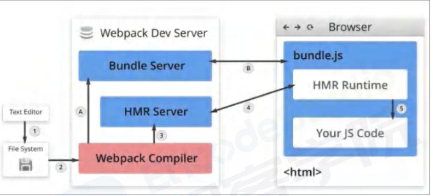
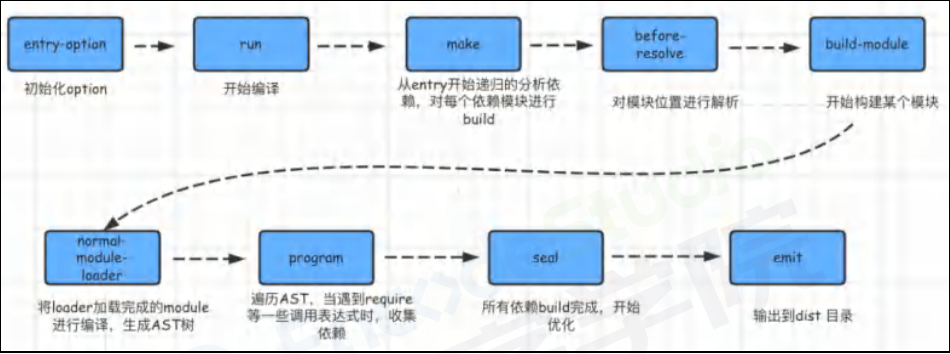

# webpack

## webpack 的热更新是什么?
#### 类型：`架构`
#### 级别：`W3`、`W4`、`W5`、`W6`
#### 解答（2 分）：
- **1：** Hot Module Replacement 简称 HRM
- **1：** 模块热替换，指在应用程序运行过程中，替换、添加、删除模块，而无需重新刷新整个应用

## webpack 中如何配置开启热更新？
#### 类型：`架构`
#### 级别：`W3`、`W4`、`W5`、`W6`
#### 解答（2 分）：
- **2：**
```javascript
const webpack = require("webpack");
module.exports = {
  // ...
  devServer: {
    // HMR
    hot: true,
    // hotOnly: true
  },
};
```
## webpack 的热更新原理?
#### 类型：`架构`
#### 级别：`W3`、`W4`、`W5`、`W6`
#### 解答（4 分）：
- **1：** 在编写未经过 webpack 打包的源代码后，Webpack Compile 将源代码和 HMR Runtime 一起编译成 bundle 文件，传输给 Bundle Server 静态资源服务器，
- **1：** 当某一个文件或者模块发生变化时，webpack 监听到文件变化对文件重新编译打包，编译生成唯一的hash 值，这个 hash 值用来作为下一次热更新的标识根据变化的内容生成两个补丁文件: manifest (包含了 hash 和 chundId ，用来说明变化的内容)和 chunk.js 模块。
- **1：** 由于 socket 服务器在 HMR Runtime 和 HMR Server 之间建立 websocket 链接，当文件发生改动的时候，服务端会向浏览器推送一条消息，消息包含文件改动后生成的 hash 值，如下图的h 属性，作为下一次热更细的标识
- **1：** 在浏览器接受到这条消息之前，浏览器已经在上一次 socket 消息中已经记住了此时的 hash 标识这时候我们会创建一个 ajax 去服务端请求获取到变化内容的 manifest 文件mainfest 文件包含重新 build 生成的 hash 值，以及变化的模块，对应上图的 c 属性浏览器根据 manifest 文件获取模块变化的内容，从而触发 render 流程，实现局部模块更新。


## 简述webpack的构建流程？
#### 类型：`架构`
#### 级别：`W3`、`W4`、`W5`、`W6`
#### 解答（3 分）：
- **1：** 初始化流程：从配置文件和 Shell 语句中读取与合并参数，并初始化需要使用的插件和配置插件等执行环境所需要的参数
- **1：** 编译构建流程：从 Entry 发出，针对每个 Module 串行调用对应的 Loader 去翻译文件内容，再找.到该 Module 依赖的 Module，递归地进行编译处理
- **1：** 输出流程：对编译后的 Module 组合成 Chunk，把 Chunk 转换成文件，输出到文件系统



